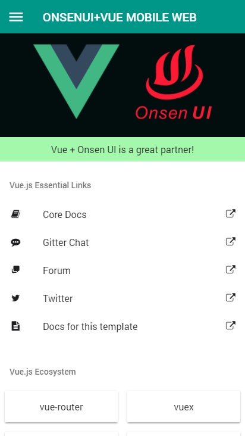
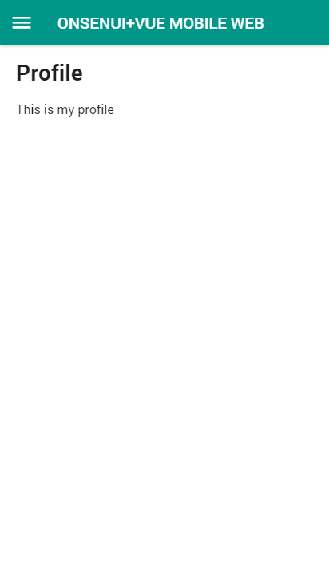
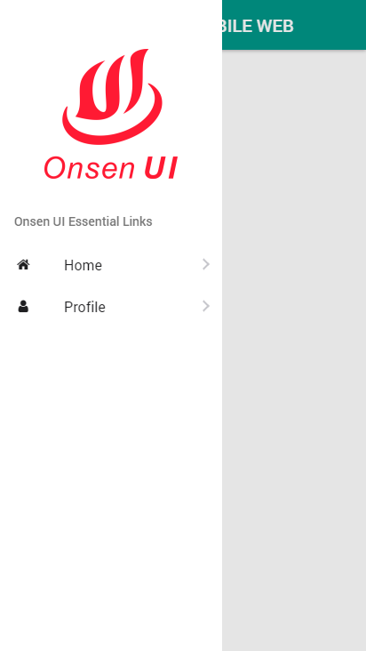
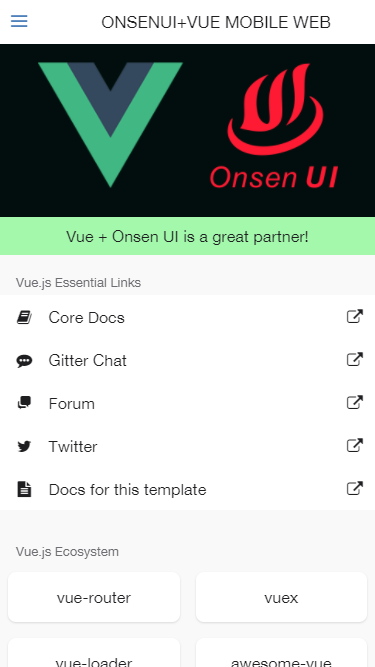
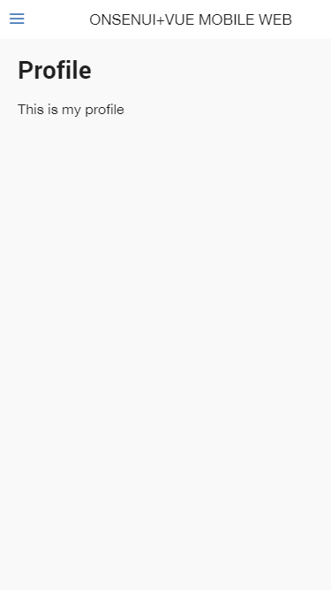
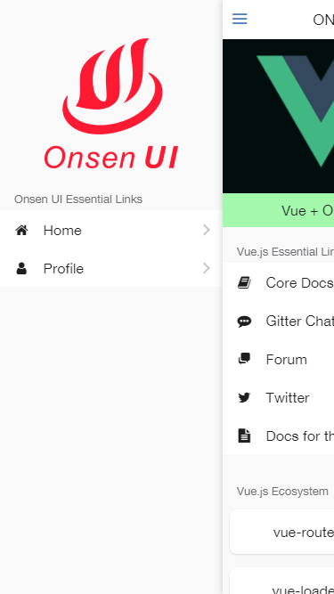

# Onsen UI + Vue + Vue Router + Axios PWA Starter Project

## Information 
Please read carefully before use this project starter

1. This project is based on [onsenui-vue-pwa webpack template](https://github.com/OnsenUI/vue-pwa-webpack)
2. Since I dont need PWA at the moment, so I remove all the script related to PWA in `index.html`. If you want to use PWA, just rename `index-serviceworker.html` to `index.html`
3. Since I need to access the page via URL in the browser, so instead of using Onsen ui `<v-ons-navigator>` system, I use [vue-router](https://router.vuejs.org/en/) to meet my requirement.
4. For some pages and components I split the `html` and `scss` in `*.vue` into  separate file for my convenience, following [Ionic2 project structure](https://www.joshmorony.com/ionic-2-first-look-series-your-first-ionic-2-app-explained/). However if you prefer the vue way, you can use common [vue project structure](https://github.com/vuejs-templates/webpack/tree/master/template/src).
5. Use `eslint-airbnb`, thus every line of code should follow [airbnb javascript style guide](http://airbnb.io/javascript/)
6. Additional rules was added to eslintrc.js as follows : 
    - `'no-console': 0`,        // allow console.log
    - `'no-param-reassign': 0`  // disable warning when assignment to property of function parameter

-------------------------------

## List of features implemented in this project
1. Side menu navigation 
2. Application state management using `Vuex`
3. Page and component creation 
4. RESTAPI consumption using `axios`
5. Custom routing on onsenui-vue using vue-router

-------------------------------

## Dependencies 
- [onsenui](https://github.com/OnsenUI/OnsenUI)
- [vue](https://github.com/vuejs/vue)
- [vue-onsenui](https://github.com/OnsenUI/OnsenUI/tree/master/bindings/vue)
- [vue-router](https://github.com/vuejs/vue-router)
- [vuex](https://github.com/vuejs/vuex)
- [axios](https://github.com/mzabriskie/axios)

-------------------------------

## Build Setup

``` bash
# install dependencies
npm install

# serve with hot reload at localhost:8080
npm run dev

# build for production with minification
npm run build

# build for production and view the bundle analyzer report
npm run build --report

# run unit tests
npm run unit

# run e2e tests
npm run e2e

# run all tests
npm test
```

For detailed explanation on how things work, checkout the [guide](http://vuejs-templates.github.io/webpack/) and [docs for vue-loader](http://vuejs.github.io/vue-loader).

-------------------------------

## Reference : 
- Separate HTML and SCSS file. [link](https://github.com/vuejs/vueify/issues/35)
- Enable scss working in vue [link](https://github.com/vuejs/vue-loader/issues/363)
- Vue routing using hash setup. [link](http://router.vuejs.org/en/essentials/getting-started.html)
- Getting started with vuex. [link](http://vuex.vuejs.org/en/getting-started.html)
- Delete service worker. [link](https://stackoverflow.com/a/34791693/1843755)

-------------------------------
## Screenshots :

<div>
    <div style="width:50%;float:left;">
        <p>Android</p>
        <kbd>
             
        </kbd>
        <kbd>
             
        </kbd>
        <kbd>
             
        </kbd>
        <kbd>
             
        </kbd>
    </div>
    <div style="width:50%;float:left;">
        <p>iPhone</p>
        <kbd>
             
        </kbd>
        <kbd>
             
        </kbd>
        <kbd>
             
        </kbd>
        <kbd>
             
        </kbd>
    </div>
</div>
